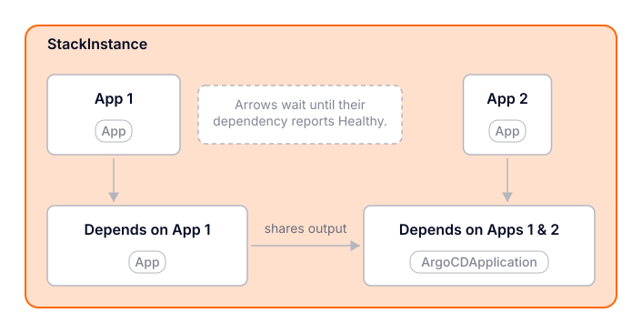

# Certified Stacks

<p align="center">
  
</p>

Certified Stacks are tested [vCluster Platform StackTemplates](https://www.vcluster.com/docs/platform/next/understand/what-are-stacks) and supporting resources for multi-application integrations. A Stack coordinates Apps or Argo CD Applications as one unit, including dependency ordering, health gates, shared parameters, and values passed between tasks.

vCluster Platform bundles the certified resources from this repository. Each Platform release pins its own copy, while this repository contains the source manifests, generated artifacts, examples, tests, and implementation guidance used to build them.

> [!IMPORTANT]
> This branch contains Certified Stacks built on the native Stacks API introduced with vCluster Platform 4.12. The earlier Terraform-based reference implementations remain available on the [`certified-stacks-legacy`](https://github.com/loft-sh/certified-stacks/tree/certified-stacks-legacy) branch.

## Available integrations

The initial native catalog contains NVIDIA Run:ai:

| Integration | Deployment models | Components |
| --- | --- | --- |
| [NVIDIA Run:ai](run-ai/) | Dedicated control plane and central control plane | vCluster, NVIDIA GPU components, and NVIDIA Run:ai |

See the [NVIDIA Run:ai integration guide](https://www.vcluster.com/docs/platform/next/integrations/certified-stacks/runai) to choose a deployment model and understand its prerequisites.

## Use a Certified Stack

If you want to install an existing Certified Stack, use the resources bundled with vCluster Platform instead of applying this repository's development sources. Platform exposes the templates through its catalog and keeps the bundled resources aligned with the installed Platform release.

- [Browse Certified Stacks](https://www.vcluster.com/docs/platform/next/integrations/certified-stacks)
- [Install and manage a Certified Stack](https://www.vcluster.com/docs/platform/next/administer/templates/certified-stacks)
- [Troubleshoot Stacks](https://www.vcluster.com/docs/platform/next/troubleshoot/stacks)

Copy a bundled StackTemplate when you need to customize it. Give the copy a different name and remove the `vcluster.com/certified` annotation so its ownership and update behavior remain clear.

## Build a custom Stack

A native Stack has three main parts:

- An **App** or **ArgoCDApplicationTemplate** defines each deployable application.
- A cluster-scoped **StackTemplate** defines the task graph, parameters, dependencies, health gates, and outputs.
- A project-scoped **StackInstance** applies the template to a tenant cluster or control plane cluster.

Start with the [runnable starter Stack](https://www.vcluster.com/docs/platform/next/administer/templates/create-stack-templates/#deploy-a-starter-stack) to deploy a two-task example before adapting the patterns in this repository. The broader [Create a Stack template](https://www.vcluster.com/docs/platform/next/administer/templates/create-stack-templates) guide documents the shipped task schema, validation rules, and output handling. Use the [StackTemplate](https://www.vcluster.com/docs/platform/next/api/resources/stacktemplate) and [StackInstance](https://www.vcluster.com/docs/platform/next/api/resources/stackinstance) API references for individual fields.

### Test locally

Test against a non-production vCluster Platform 4.12 or later installation. Connect `kubectl` to the Platform management API, then apply the resources in dependency order:

```bash
vcluster platform connect management
kubectl apply -f <apps-directory>
kubectl apply -f <stack-template>
kubectl apply -f <stack-instance>
```

Watch the StackInstance and its child resources until every task is healthy:

```bash
kubectl get stackinstance <name> -n <project-namespace> \
  -o jsonpath='{.status.phase}{"\n"}{range .status.tasks[*]}{.name}{"\t"}{.phase}{"\t"}{.message}{"\n"}{end}'
```

Before proposing a Stack for this catalog, test more than the initial installation:

- Validate required and optional parameters, including invalid input.
- Exercise each supported destination and deployment model.
- Confirm dependencies block and resume as expected when a child is unhealthy.
- Verify task outputs and published outputs, including sensitive values.
- Update parameters and referenced templates, then verify reconciliation.
- Remove a task under both `Retain` and `Prune` policies when both behaviors apply.
- Delete the StackInstance and document resources that intentionally remain.
- Test failure recovery and provide troubleshooting steps for integration-specific failures.

Do not commit credentials, tokens, private keys, or rendered Secrets. Use placeholders in examples and document how users provide sensitive values.

## Contribute a Certified Stack

Using the native API does not by itself make a Stack certified. Certification means the integration has been reviewed, tested, and accepted into this catalog for bundling with vCluster Platform.

Keep each integration in its own top-level directory. A contribution should include:

- A README for every supported Stack or deployment model, covering architecture, prerequisites, parameters, installation, verification, upgrades, removal, and known limitations.
- Every App or ArgoCDApplicationTemplate referenced by the StackTemplate.
- The StackTemplate and at least one example StackInstance or tenant cluster configuration.
- Automated checks for generated files and integration-specific invariants.
- Reproducible generation instructions when committed manifests are rendered from source files.
- Names that cannot collide with other cluster-scoped Apps or StackTemplates in the catalog.

Use the [NVIDIA Run:ai implementation](run-ai/) as the current full example. Its [`source/`](run-ai/source/) directory is authoritative; the `dedicated-control-plane/` and `central-control-plane/` directories are generated and must not be edited directly. See the [Run:ai contributor guide](run-ai/CONTRIBUTING.md) for its source-sharing and variant rules.

For Run:ai changes, render and verify the generated manifests from the repository root:

```bash
./run-ai/render.sh
./run-ai/render.sh --check
```

The checks require Bash 4 or later, Python 3 with PyYAML, and `rg`. Review all generated changes before opening a pull request.

When you open a pull request, describe the integration and supported deployment models, identify the vCluster Platform version used for testing, and include the results of installation, update, failure-recovery, and removal tests. Call out resources that survive removal or require manual cleanup.

## License

This repository is licensed under the [Apache License 2.0](LICENSE).
