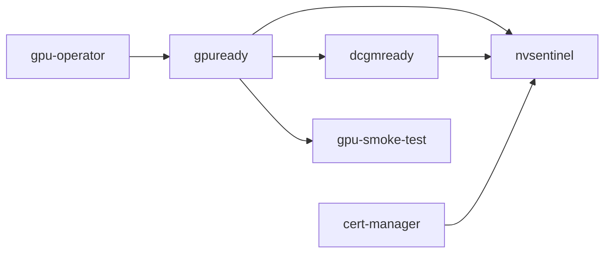

# NVIDIA GPU Operator Certified Stack

This integration turns a tenant cluster with NVIDIA GPU workers into one that can run CUDA workloads. It installs cert-manager, the NVIDIA GPU Operator, and NVSentinel as one native vCluster Platform Stack. Two readiness gates hold the Stack until the scheduler actually advertises GPUs and the DCGM host engine is serving. A CUDA smoke test then proves that a GPU computes.

Every task is a native `app` task. The Stack needs no Argo CD connector, no custom container image, and no chart repository beyond the three upstream charts. Gate and smoke-test Jobs run on the image vCluster Platform itself runs, exposed to Apps as `.Values.__image__`.

## Architecture



| Task | `dependsOn` | Timeout | App | Purpose |
| --- | --- | --- | --- | --- |
| `cert-manager` | none | `15m0s` | `nvidia-gpu-operator-stack-cert-manager`, or `-gate` when cert-manager is preinstalled | Installs cert-manager v1.20.3, or verifies an existing installation |
| `gpu-operator` | none | `20m0s` | `nvidia-gpu-operator-stack-gpu-operator` | Installs NVIDIA GPU Operator v26.3.3 |
| `gpuready` | `gpu-operator` | `28m0s` | `nvidia-gpu-operator-stack-gate` | Waits until `minGPUs` of `nvidia.com/gpu` are allocatable, then publishes the GPU contract |
| `dcgmready` | `gpuready` | `15m0s` | `nvidia-gpu-operator-stack-gate` | Waits until every `nvidia-dcgm` DaemonSet pod is ready |
| `gpu-smoke-test` | `gpuready` | `12m0s` | `nvidia-gpu-operator-stack-smoke-test` | Runs NVIDIA's CUDA VectorAdd sample on one GPU |
| `nvsentinel` | `gpuready`, `dcgmready`, `cert-manager` | `20m0s` | `nvidia-gpu-operator-stack-nvsentinel` | Installs NVSentinel v1.13.0 in dry-run monitoring mode |

A task is healthy when its AppInstance is ready. Every App sets `wait: true`, so Platform runs Helm with `--wait --wait-for-jobs`. For the chart tasks that means every Deployment and DaemonSet in the chart is ready. For the gate and smoke-test tasks it means their Job completed, and a failed Job fails the task.

### Why the gates exist

The GPU Operator release becomes ready as soon as its operator and Node Feature Discovery pods run. That can be minutes before a driver is built, the device plugin registers, and the scheduler admits a pod that requests `nvidia.com/gpu`. Anything that needs the GPU Operator to be useful, rather than merely installed, needs a stronger signal.

`gpuready` counts allocatable `nvidia.com/gpu` across the nodes that match `gpuNodeSelector`, which is the signal that decides whether a GPU pod can schedule. It does not wait on `ClusterPolicy` by default. `ClusterPolicy` aggregates every operand, so it stays `notReady` while `dcgm-exporter` loses a startup race that nothing downstream depends on. That cost about 90 seconds in a measured run. Set `waitForClusterPolicy` to hold for the whole operand set instead.

`dcgmready` exists because the GPU Operator creates `dcgm-exporter` and `nvidia-dcgm` together, with nothing ordering them. On a cold start, NVSentinel can begin against a DCGM host engine that is not serving yet and report `GpuDcgmConnectivityFailure`. The gate waits for `kubectl rollout status` on the DaemonSet, which holds for every GPU node rather than for exactly one pod. It follows `gpuready` because a DaemonSet that schedules no pods yet has already finished rolling out.

Both gates are the same App with different parameters. [docs/stack-gate.md](docs/stack-gate.md) covers how the gate works, its full parameter set, and how to reuse it in another Stack.

### Outputs

When `gpuready` passes, it marks the `gpu-stack/gpu-stack-contract` ConfigMap ready. The task reads its outputs from that ConfigMap. `nvsentinel` takes its DCGM address from those outputs rather than from a hard-coded value:

| Output | Source key | Consumed by |
| --- | --- | --- |
| `gpucount` | `observedCount` | Published only |
| `dcgmhost` | `dcgmHost` | `nvsentinel` |
| `dcgmport` | `dcgmPort` | `nvsentinel` |

All three are published on the StackInstance.

### Skipping cert-manager when it is already installed

A Stack task cannot be skipped. The `cert-manager` task switches the App it references instead:

```yaml
templateRef:
  name: 'nvidia-gpu-operator-stack-{{ if eq (toString .Values.certManagerPreinstalled) "true" }}gate{{ else }}cert-manager{{ end }}'
```

With `certManagerPreinstalled: "true"`, the task runs the gate against the existing installation. The gate waits for `deployment/cert-manager-webhook` in the `cert-manager` namespace to report `Available` and installs nothing. If the cluster was declared to have cert-manager and does not, the task fails with a clear reason instead of letting NVSentinel start without certificate issuance.

### Node placement

Two optional selectors, each a single `key=value` node label, control placement:

| Component | `cpuNodeSelector` set | `gpuNodeSelector` set | Neither set |
| --- | --- | --- | --- |
| cert-manager, GPU Operator controller, NFD master and garbage collector, gate Jobs, NVSentinel labeler | On matching nodes | n/a | Any untainted node |
| NFD workers | n/a | On matching nodes | Every node |
| NVIDIA driver, toolkit, device plugin, DCGM, validators | GPU Operator's own discovery labels | Same | Same |
| NVSentinel health monitors, metadata collector, `platformConnector` | n/a | On matching nodes | `nvidia.com/gpu.present=true` |
| `gpuready` capacity count | n/a | Matching nodes only | Every node |
| CUDA smoke test | n/a | On matching nodes | Wherever a GPU is free |

Every GPU-side component tolerates the `nvidia.com/gpu` `NoSchedule` taint, so GPU workers can be reserved with that taint. [example/node-profiles.yaml](example/node-profiles.yaml) defines a matching pair of NodeProfiles: `cpu-services` labels its nodes `workload.example.com/pool=cpu-services`, and `gpu-compute` labels its nodes `workload.example.com/pool=gpu-compute` and applies the taint.

Size the CPU pool for what the Stack places there: cert-manager's three pods, the GPU Operator controller, NFD master and garbage collector, the gate Jobs, and system pods. On a 2 CPU / 4 GiB worker the 5-minute load average reached 4.10 during image extraction. The GPU Operator controller then lost its leader election lease and restarted three times. A 4 CPU / 8 GiB worker had enough headroom.

## Requirements

- vCluster Platform 4.12 or later, with the Apps feature. Stacks need no separate license feature.
- vCluster 0.37 or later on the tenant cluster to deploy the Stack through `deploy.stacks`. A StackInstance also works against an existing tenant cluster.
- At least one NVIDIA GPU worker with a GPU Operator-supported OS, kernel, and GPU. With `driverPreinstalled: "false"`, the GPU Operator builds the driver, which needs access to `nvcr.io`.
- Nodes that can pull the vCluster Platform image for the gate Jobs. With a mirrored Platform registry, the tenant cluster's workload ServiceAccount needs a matching image pull secret.
- Chart access from vCluster Platform, which runs Helm: `charts.jetstack.io`, `helm.ngc.nvidia.com`, and `ghcr.io`.
- Image access from the tenant cluster's nodes: `quay.io`, `nvcr.io`, `ghcr.io`, and `registry.k8s.io`, or mirrors of them.
- `kubectl` with a Platform management context, plus a tenant cluster kubeconfig to verify the result.

## Files

| Path | Purpose |
| --- | --- |
| [`stacktemplate.yaml`](stacktemplate.yaml) | `nvidia-gpu-operator-stack`, the StackTemplate |
| [`apps/`](apps/) | The five Apps the tasks reference |
| [`example/stackinstance.yaml`](example/stackinstance.yaml) | Applies the Stack to an existing tenant cluster |
| [`example/vcluster-template-with-gpu-stack.yaml`](example/vcluster-template-with-gpu-stack.yaml) | A tenant cluster template with private-node CPU and GPU pools that deploys the Stack through `deploy.stacks` |
| [`example/node-profiles.yaml`](example/node-profiles.yaml) | Optional `cpu-services` and `gpu-compute` NodeProfiles |
| [`docs/stack-gate.md`](docs/stack-gate.md) | The reusable readiness gate |
| [`test-certified-manifests.sh`](test-certified-manifests.sh) | Static and rendered checks. No cluster needed |
| [`tests/verify-stack.sh`](tests/verify-stack.sh) | Verifies a deployed Stack against a live tenant cluster |

## Configure parameters

| Parameter | Default | Description |
| --- | --- | --- |
| `cpuNodeSelector` | empty | `key=value` node label for controllers and gate Jobs |
| `gpuNodeSelector` | empty | `key=value` node label for GPU workers |
| `driverPreinstalled` | `false` | `true` when the node image already contains the NVIDIA driver. The GPU Operator skips the driver, and NVSentinel's labeler assumes it is installed. The toolkit is still installed |
| `certManagerPreinstalled` | `false` | `true` verifies an existing cert-manager in the `cert-manager` namespace instead of installing one |
| `waitForClusterPolicy` | `false` | `true` also waits for `ClusterPolicy` to report `ready` before `gpuready` passes |
| `minGPUs` | `1` | Allocatable GPUs the scheduler must advertise before `gpuready` passes |

Chart versions are pinned in each App, because Platform does not template App chart fields. The versions are cert-manager v1.20.3, NVIDIA GPU Operator v26.3.3, and NVSentinel v1.13.0.

## Install

If you use the bundled integration, skip the first `kubectl apply`: Platform already provides the Apps and the StackTemplate. From this directory, with a Platform management context:

```bash
vcluster platform connect management
kubectl apply -f apps/
kubectl apply -f stacktemplate.yaml
```

A `templateRef` resolves when the task runs, so a missing App leaves its task `Blocked` rather than failing it.

### On a new tenant cluster

Edit [example/vcluster-template-with-gpu-stack.yaml](example/vcluster-template-with-gpu-stack.yaml). Replace `<node-provider>`, `<gpu-node-type>`, and `<cpu-node-type>` with a node provider and node types from your installation. The `vcluster.com/profile` property in `nodeTypeSelector` names a node type the provider publishes. Despite the name, it is unrelated to the NodeProfile named in `profile`.

```bash
kubectl apply -f example/node-profiles.yaml
kubectl apply -f example/vcluster-template-with-gpu-stack.yaml
```

Create a tenant cluster from **NVIDIA GPU tenant cluster**. Platform creates the StackInstance when the tenant cluster is provisioned. Make sure the project allows the template, the node provider, and both NodeProfiles.

### On an existing tenant cluster

Set the namespace, owner, tenant cluster name, and selectors in [example/stackinstance.yaml](example/stackinstance.yaml). Leave both selectors empty if the tenant cluster has no pool labels. Then apply it:

```bash
kubectl apply -f example/stackinstance.yaml
```

## Verify

Follow the aggregate phase and each task:

```bash
kubectl get stackinstance <name> -n <project-namespace> \
  -o jsonpath='{.status.phase}{"\n"}{range .status.tasks[*]}{.name}{"\t"}{.phase}{"\t"}{.message}{"\n"}{end}'
```

The phase moves through `Pending` and `Progressing` to `Healthy`. `cert-manager` and `gpu-operator` progress together. `gpuready` stays `Progressing` while the driver builds and the device plugin registers. Watch it from the tenant cluster:

```bash
kubectl -n gpu-stack logs -f -l app.kubernetes.io/component=gpuready --tail=-1
kubectl -n gpu-stack get configmap gpu-stack-contract -o yaml
kubectl -n gpu-stack logs -l app.kubernetes.io/name=nvidia-gpu-operator-stack-smoke-test --tail=-1
```

The smoke-test log ends with `Test PASSED`. To check the whole result in one pass:

```bash
PLATFORM_CONTEXT=<platform-context> TENANT_CONTEXT=<tenant-context> \
  STACK_NAMESPACE=<project-namespace> STACK_NAME=<name> \
  bash tests/verify-stack.sh
```

## Upgrade

- **Chart versions:** change the version in the App, review the upstream release notes, and apply the App. Each AppInstance that references it runs `helm upgrade`. GPU Operator upgrades can restart the driver and interrupt GPU workloads on each node.
- **Parameters:** a changed StackInstance parameter re-renders the affected tasks. The gate Job name carries a hash of its settings, so a changed gate setting creates a new Job and runs the gate again.
- **Tenant cluster template:** a VirtualClusterInstance keeps the template parameters it was created with. Use **Sync Template** in the Platform UI, or set `spec.templateRef.syncOnce: true`, before an existing tenant cluster sees template changes.
- **Changing `certManagerPreinstalled` on a live instance:** this switches the task to a different App. Set `prunePolicy: Prune` on the StackInstance, or delete the old AppInstance, so the previous release does not linger.

## Remove

Delete the StackInstance. Each AppInstance uninstalls its Helm release.

```bash
kubectl delete stackinstance <name> -n <project-namespace>
```

These remain on purpose and need manual cleanup if you want them gone:

- The `cert-manager`, `gpu-operator`, `nvsentinel`, and `gpu-stack` namespaces.
- cert-manager CRDs (`crds.keep: true`) and any Certificates or Issuers.
- GPU Operator and Node Feature Discovery CRDs. Helm does not delete CRDs.
- NFD and GPU feature labels on nodes (`postDeleteCleanup: false`), and node conditions NVSentinel set.

The GPU contract ConfigMap, gate Jobs, and gate RBAC belong to their Helm releases and are removed with them.

## Troubleshooting

- **cert-manager or GPU Operator controller `Pending`:** no node matches `cpuNodeSelector`, or every matching node is tainted.
- **`gpuready` stays `Progressing`:** read the gate log. A long wait on allocatable capacity means the driver is still building or the device plugin has not registered. Check `kubectl -n gpu-operator get pods` and `kubectl get nodes -o json | jq '.items[] | {name: .metadata.name, gpu: .status.allocatable["nvidia.com/gpu"]}'`.
- **`gpuready` failed:** the gate gives up after 23 minutes, which includes the time for a GPU worker to join. The AppInstance retries after 1, 5, and 15 minutes, uninstalling and reinstalling the release so the gate runs again, and the task turns `Healthy` if a retry passes. Change the task or the App to retry sooner.
- **Gate Job in `ImagePullBackOff`:** tenant nodes cannot pull the vCluster Platform image. Add an image pull secret to the tenant cluster's workload ServiceAccount.
- **`gpuready` Healthy but `nvsentinel` still waiting:** a task that declares outputs is not ready until every output is captured, reported as `CapturingOutputs`. Confirm `gpu-stack-contract` has `ready`, `observedCount`, `dcgmHost`, and `dcgmPort`.
- **NVSentinel reports `GpuDcgmConnectivityFailure`:** it started before the DCGM host engine was serving. Check that `dcgmready` ran and passed.
- **`gpu-smoke-test` `Pending`:** the gate saw a free GPU, but another pod now holds it.
- **`gpu-smoke-test` failed:** a pull error points at `nvcr.io` access. A CUDA error points at the driver or toolkit, not scheduling.
- **cert-manager task failed with `certManagerPreinstalled: "true"`:** there is no `Available` `cert-manager-webhook` Deployment in the `cert-manager` namespace.

## Known limitations

- NVSentinel runs in dry-run mode. Quarantine, draining, remediation, Janitor, and MongoDB are disabled, so this Stack monitors GPU health but does not recover from faults.
- The GPU taint toleration is fixed to `nvidia.com/gpu` with `NoSchedule`. Each selector is a single label.
- Platform caps a single deploy at 30 minutes. `gpuready` therefore waits at most 23 minutes per attempt, counted from when the GPU Operator is healthy.
- The Stack does not handle provider-managed GPU stacks such as GKE's default GPU node pools. Do not run it on nodes where the provider already runs a device plugin.
- The smoke test holds one GPU for the few seconds it runs.
- The DCGM address in the contract is the GPU Operator default, `nvidia-dcgm.gpu-operator.svc:5555`.

## Validation

`test-certified-manifests.sh` checks, without a cluster:

- Names, the certified annotation, and cluster-scoped name collisions with the rest of the catalog.
- Task dependencies, output references, task names that declare outputs, and output namespaces.
- Timeout layering against each App timeout, each gate deadline, and the Platform per-deploy cap.
- Each task and App, rendered with Helm's template engine for a default and a fully configured parameter set, including placement, driver mode, and the cert-manager switch.
- The gate script's pass, deadline, wait, and nothing-to-do paths, run against a stub `kubectl`.

Set `RENDER_CHARTS=1` to also render the three upstream charts with the rendered values.

The Argo CD predecessor of this Stack, with the same task graph, gates, and upstream charts, ran end to end on bare metal on 2026-09-23. The GPU node joined at 19:39:10 and `gpuready` passed at 19:44:50, with a preinstalled driver. `dcgmready` passed at 19:45:44 and the CUDA sample reported `Test PASSED`. This App-based version has not yet completed a live run. Complete the repository's [pre-submission test list](../README.md#test-locally) before it is certified.
